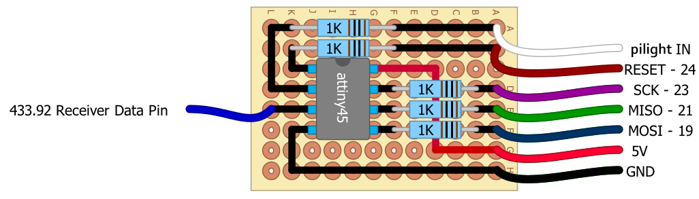

pilight firmware
=============

this is an rf receiver prefilter for pilight build with an ATTiny45 / 85. it prefilters the received signal to reduce the load for pilight (http://www.pilight.org).
you be warned: this could potentionally damage your raspberry pi and also other hardware. i take no responsability for any damages! use at your own risk!

1. Install avrgcc:
------------------
	sudo apt-get install gcc-avr avr-libc

2. Install modified avrdude:
-------------------
	wget http://project-downloads.drogon.net/files/avrdude_5.10-4_armhf.deb
	wget http://project-downloads.drogon.net/files/avrdude-doc_5.10-4_all.deb
	sudo dpkg -i avrdude_5.10-4_armhf.deb
	sudo dpkg -i avrdude-doc_5.10-4_all.deb

3. Calculate the MIN_PULSELENGTH and MAX_PULSELENGTH values
-------------------
	MIN_PULSELENGTH =  ( shortest expected pulse - 10% ) / 10
	MAX_PULSELENGTH =  ( longest expected pulse + 10% ) / 10
	
	the shortest expected pulse is the minimal base pulse-width of all your protocols
	the longest expected pulse is the maximal base pulse-width of all your protocols multiplied by 34
	
4. Compile and program ATTiny:
------------------------------
	make all
	
	make asm		# generate pilight_firmware.s file (good to review compiler generated assembler code)
	make flash		# compile and flash the ATTiny using pilight-flash on your system.

	type=t85 make ....	# generate firmware for ATTiny 85 (ATTiny25 no longer supported since VERSION 4).


Additional info:
----------------
###Calculate fuses:
	http://www.engbedded.com/fusecalc/

###Pinout:
	
I use this circuit without resistors. if you want you can even power the ATTiny with 3.3V, it works for 4 out 5 ATTiny's, but i think the timing is less accurate.
	

|  Name  | Raspberry Pi V2 | ATTiny45 | 433 Receiver| Notes
|--------|-----------------|----------|-------------|--------------------
|  MOSI  |       19        |    5     |      -      | A HI+LO signal on this ATTiny pin selects a different filter method (since version 4).
|  MISO  |       21        |    6     |      -      |
|  SCK   |       23        |    7     |      -      |
| RESET  |       24        |    1     |      -      |
| PI_IN  | see pilight cfg |    2     |      -      |
|REC_OUT |       -         |    3     |   DATA_OUT  |


to change the pins create an .avrduderc file in your home directory containing (the numbering is wiringpi numbering!):


	programmer
		id    = "gpio";
		desc  = "Use sysfs interface to bitbang GPIO lines";
		type  = gpio;
		reset = 8;
		sck   = 11;
		mosi  = 10;
		miso  = 9;
	;

###FilterMethods

Since version 4, the firmware implements four different filter methods that can be selected
in normal operation and without flashing by signalling a HI+LO on ATTiny pin 5. After going
LO the ATTiny sends a signature in about 500 microseconds.

The version 4 signature contains the selected filter method in the version
number like this: if
	version_in_signature % 100 == 4 then
	version_in_signature / 100 == Index of selected filter method, where:

	0:	Builtin default filter method; not from EEPROM; this is version 4 filter.
	1:	A new filter that is silent and only generates firmware signatures.
	2:	A new filter that generates test signal pulses (and signature).
	3:	The previous version 3 filter (check and dismiss 7 pulses before passing).
	4:	A new version 4 filter (searches longer pulse trains w/o loosing pulses). Default now.
	5:	This filter does nothing. It passes the input signal unchanged.

The firmware version 6 has an additional low pass filter (called version 6
LPF). This filter detects high frequency spikes and removes them completely.
This means the leading and trailing edge of the spike are removed. All the so
far existing filter methods listed above ignore only the trailing edge of a
spike and treat the leading edge as true signal, which it is not. Astonishingly
that this works et all and it does not so bad. The version 6 filter removes
even more noise from the reveived signal and it removes the spikes in a way
that has no impact on measuring duration of true signal pulses.

This version 6 LPF is not another filter method like those listed above. It is
implemented to work additionally and in front of existing filter methods.
Therefore it does not have a new filter method number; this filter can be
turned on and off independently which is managed by new firmware version
numbers 5 (where is is off) and 6 (on).

To manage all the versions and filter methods, the version 5 and 6 firmware
has also added capabilities to directly select a filter and a version via
firmware-control program.

Firmware version 5 is like version 4, with the same filters, but more
firmware-control capabilities (and version 6 LPF disabled, of course).
Firmware version 6 is like version 5 with version 6 LPF enabled.
The big picture is:

	Version 4 was: Receiver-signal -----------------> selected-filter-method -> Signal-to-raspi
	Version 5 is : Receiver-signal -----------------> selected-filter-method -> Signal-to-raspi
	Version 6 is : Receiver-signal -> version6-LPF -> selected-filter-method -> Signal-to-raspi

The firmware-control program can make the firmware to run in version 5 mode or
in version 6 mode and it now can select a filter method directly (controlling
version 4 was only capable to "select next" filter method).

I got best results with version 6 LPF and filter method version 4: In my
environment this filters out round about half the false pulse trains that pass
version 4 resp. 5.  Try it out yourself. If a new filter do not work for your
environment just use firmware-control to make it behave as an older version.

###ATTiny85

If you want to program an ATTiny85 add a parameter when calling make:

```
Make all type=t85
```

###Implementation details

The firmware does all the work in two interrupt service routines (ISR):
ISR(PCINT0_vect) and ISR(TIMER1_COMPA_vect).  Where ISR(PCINT0_vect) is called
each time the input pin signal changes (this is where the receiver is
connected) and ISR(TIMER1_COMPA_vect) is called constantly every 10 micro
seconds (us) which are 0.01 milli seconds (ms). In other words it gets called
100000 times per second. This is much faster than (usual) input pin changes
will happen. While no ISR routine is running the firmware does nothing and runs
a "no operation" loop. For short lets call ISR(PCINT0_vect) = "PCISR" (pin
change ISR) and ISR(TIMER1_COMPA_vect) = "TIMERISR" ´(timer ISR).

The main job of TIMERISR is measuring durations between various events and to
send the firmware signature about every second. Further it does half the work
of filter methods.

The job of PCISR is to handle detected pin changes (which may by from receiver
on some pin or from firmware control program on a different pin) and thereby
doing the other half of filter methods..

Each filter method is implemented as a separate function. The address of the
selected filter method's function is present in the global execute_filter variable.
A filter method is called with one parameter that indicates the event that
caused the call:
In case of a pin change the filter method is called with a non zero parameter.
In case of a timer event the filter method is called with a zero parameter.
In both cases global variable recving_since_10_us contains the time passed since
last pin change event and recv_ison() indicates if the input signal is currently
H(on) or L(off).

Output of signals is done by turning the output pin on (H, send_on()) or off
(L, send_off()) or toggle its current state (send_toggle()). Filter methods may
call send_on() or send_off() directly and if they do, have to care for correct
duration themself. Instead they can just call send_single_pulse(duration_10_us)
repeatedly (not in a private loop but each time the method is called itself).
send_single_pulse() returns true if the pulse was completely sent.  In this
case the filter method should look for a new duration that it will use next
time when calling send_single_pulse(). As long as send_single_pulse() returns
false it must be called with the same duration value all the time.

A filter method implementation should prevent introducing global (or static)
variables because this limits the available RAM that can be used for the ring
buffer of filter method 4. Instead filter method implementations should try
to re-use some global variables of the signature sender.

The signature sender stops filter processing - it even disables pin change
interrupts et all.
